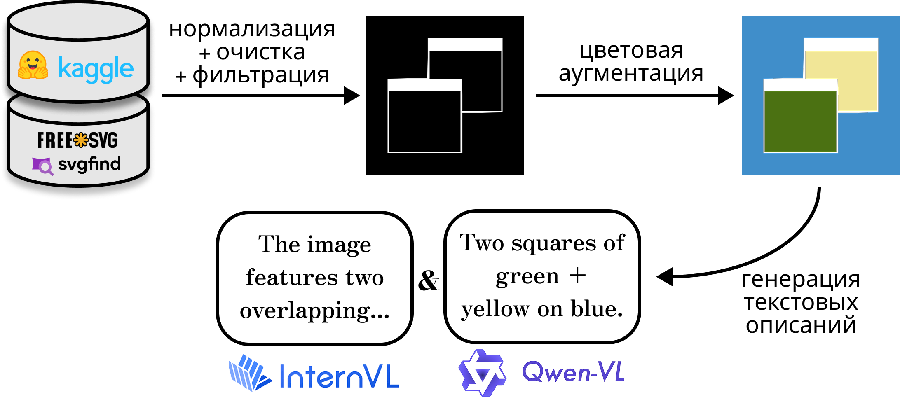

# Text2SVG

🌐 Доступные языки: [English](README.md) | [Русский](README.ru.md)

Text2SVG — это набор инструментов для оптимизации, описания и генерации SVG на основе текста.  
Проект состоит из трёх основных компонентов, формирующих полный пайплайн: от сбора исходных SVG-файлов до генерации новых SVG с использованием БЯМ.

```
Text2SVG
├── svg-corpus         
│   ├── mining         # Скрапинг SVG
│   ├── optimization   # Двухэтапная оптимизация
│   └── captioning     # Генерация описаний с помощью VLM
├── llm4svg            # Дообучение БЯМ под домен SVG
└── svg-encoder        # Энкодер SVG
```

## Быстрый старт

```bash
git clone https://github.com/CTLab-ITMO/Text2SVG
cd Text2SVG
pip install .
apt update && apt install libcairo2
```

## Пайплайн сбора и обработки корпуса SVG



### Сбор SVG
[](https://colab.research.google.com/drive/1QVc6mTDZSI9ZyU5L-bc3yYwIIz4Nrxka?usp=sharing)

Инструмент для сбора SVG-файлов с сайтов на основе URL из датасетов HuggingFace.  
Собирает около 4 миллионов уникальных изображений в месяц с учётом дедупликации.


#### Установка

```bash
cd Text2SVG/svg-corpus/mining
pip install -r requirements.txt
```

#### Пример запуска

Вы можете выбрать любой датасет из коллекции HuggingFace, содержащий колонку с названием url.

```bash
python3 main.py --dataset nhagar/fineweb_urls --output-dir /path/to/output
```

#### Расширенные параметры

В зависимости от вашей системы вы можете изменить аргументы запуска:

- **`--max-concurrency`** (по умолчанию: 500): Определяет максимальное количество одновременных HTTP-запросов.

- **`--batch-size`** (по умолчанию: 50000): Количество URL, обрабатываемых за один пакет.

- **`--timeout`** (по умолчанию: 1): Максимальное время ожидания (в секундах) для каждого HTTP-запроса. Агрессивное значение позволяет пропускать "медленные" сайты.

```bash
python3 main.py \
  --dataset nhagar/fineweb_urls \
  --column url \
  --output-dir /path/to/output \
  --max-concurrency 500 \
  --batch-size 50000 \
  --timeout 1 \
  --start-offset 0 \
  --debug
```

#### Формат результата

SVG-файлы сохраняются в формате JSONL, сгруппированы по префиксам хэшей MD5:

```json
{
  "url": "https://example.com/page",
  "timestamp": "2024-03-21T10:30:45.123456",
  "svg": "<svg>...</svg>"
}
```

**Пример датасета:**  
Небольшая часть собранных SVG доступна по [ссылке](https://huggingface.co/datasets/VectorGraphics/open-svg).

### Оптимизация


[](https://colab.research.google.com/drive/14HTBFO7PNMj5uFQrOGfv0fStjkca_mjk?usp=sharing)

Двухэтапный процесс оптимизации для очистки и нормализации SVG-файлов:

1. **Этап 1:** Преобразование путей и нормализация координат к диапазону [0, 256]
2. **Этап 2:** Оптимизация с помощью SVGO для уменьшения размера и удаления лишнего

#### Python API

```python
from optimization import optimize_svg_string

# Basic optimization
result = optimize_svg_string(svg_string)

# With custom options
result = optimize_svg_string(
    svg_string=svg_text,
    stage1_opts={
        "normalize_scale": 256.0,
        "cubic_only": True,
        "normalize_to_int": False
    },
    stage2_config_path='./svgo.config.mjs',
    quiet=True
)
```

#### CLI

```bash
optimize_dir \
  --input_dir ./raw_svgs \
  --output_dir ./optimized_svgs \
  --cubic_only \
  --normalize_points \
  --normalize_scale 256 \
  --num_threads 4 \
  --svgo_config ./svgo.config.mjs
```

#### Пример оптимизации до/после

**До оптимизации (648 символов):**
```xml
<svg version="1.1" xmlns="http://www.w3.org/2000/svg" width="20" height="20" viewBox="0 0 20 20">
<title>power</title>
<path d="M10.625 1.681c0-0.345-0.28-0.625-0.625-0.625s-0.625 0.28-0.625 0.625v8.125c0 0.345 0.28 0.625 0.625 0.625s0.625-0.28 0.625-0.625v-8.125z"></path>
<path d="M7.12 2.881c0.318-0.135 0.466-0.502 0.33-0.82s-0.502-0.466-0.82-0.33c-3.156 1.343-5.38 4.436-5.38 8.075 0 4.845 3.905 8.75 8.75 8.75s8.75-3.905 8.75-8.75c0-3.639-2.225-6.732-5.38-8.075-0.318-0.135-0.685 0.013-0.82 0.33s0.013 0.685 0.33 0.82c2.719 1.157 4.62 3.814 4.62 6.925 0 4.155-3.345 7.5-7.5 7.5s-7.5-3.345-7.5-7.5c0-3.111 1.9-5.768 4.62-6.925z"></path>
</svg>
```


**После оптимизации (343 символа, сжатие на 47%):**
```xml
<svg viewBox="0 0 256 256">
  <path d="M136 22Q135 14 128 14T120 22V126Q121 133 128 134 135 133 136 126z"/>
  <path d="M91 37Q98 33 95 26 92 20 85 22C44 39 16 79 16 126 16 188 66 238 128 238S240 188 240 126C240 79 212 39 171 22Q164 20 161 26 158 33 165 37C200 52 224 86 224 126 224 179 181 222 128 222S32 179 32 126C32 86 56 52 91 37"/>
</svg>
```


### Генерация текстовых описаний

Генерация описаний SVG с использованием VLM через [LMDeploy](https://github.com/InternLM/lmdeploy).  
Пайплайн поддерживает любые модели, совместимые с LMDeploy, включая InternVL, Qwen2-VL и др.

#### Установка

```bash
cd Text2SVG/svg-corpus/captioning
pip install lmdeploy timm
```

#### Пример запуска

```bash
python caption_intern.py \
  --dataset VectorGraphics/svg-corpus \
  --output captions.jsonl \
  --model OpenGVLab/InternVL3-2B
```

#### Расширенный запуск

```bash
python caption_intern.py \
  --dataset VectorGraphics/svg-corpus \
  --output detailed_captions.jsonl \
  --model OpenGVLab/InternVL3-8B \
  --batch-size 32 \
  --resolution 224 \
  --temperature 0.1 \
  --tp 1 \
  --max-samples 100_000
```

#### Параметры

| Параметр         | Тип   | По умолчанию                        | Описание |
|------------------|--------|--------------------------------------|----------|
| `--model`        | str    | `OpenGVLab/InternVL3-2B`             | Название модели или путь (любая VLM, совместимая с LMDeploy) |
| `--dataset`      | str    | `VectorGraphics/svg-corpus`         | Имя датасета или путь к локальному JSONL-файлу |
| `--data-files`   | str    | `*_stage2*`                          | Шаблон для выбора файлов в датасетах HuggingFace |
| `--output`       | str    | `augmented_captioned_internvl3_2b.jsonl` | Путь к выходному JSONL-файлу |
| `--resolution`   | int    | `224`                                | Разрешение изображений для обработки |
| `--batch-size`   | int    | `64`                                 | Размер батча при обработке |
| `--temperature`  | float  | `0.01`                               | Температура генерации |
| `--tp`           | int    | `1`                                  | Число GPU |
| `--session-len`  | int    | `16384`                              | Размер контекста |
| `--timeout`      | int    | `1`                                  | Таймаут при конвертации SVG в PNG |
| `--start-index`  | int    | `0`                                  | Индекс, с которого начать обработку датасета |
| `--max-samples`  | int    | `None`                               | Лимит на количество обрабатываемых примеров |
| `--seed`         | int    | `12343`                              | Фиксируем рандом |


#### Формат результата

Описания сохраняются в формате JSONL:

```json
{
  "hash": "a1b2c3d4...",
  "caption": "A blue circular icon with a power symbol",
  "source": "InternVL3-2B",
  "prompt": "Describe this object in 10 words or less, concise style. Response in English."
}
```

## Обучение LLM

### Примеры сгенерированных SVG


### Обучение

Дообучение модели осуществляется с использованием фреймворка [Unsloth](https://github.com/unslothai/unsloth).

#### Предварительные шаги

```bash
cd Text2SVG/llm4svg
pip install unsloth transformers datasets wandb
```

#### Конфигурация обучения

Скрипт обучения (`run_training.py`) использует следующие основные параметры:

- **Базовая модель**: Qwen2.5-Coder-32B-Instruct
- **Датасет**: VectorGraphics/svg-corpus
- **LoRA-конфигурация**: r=128, alpha=32, применяется ко всем слоям внимания
- **Обучение**: 1 эпоха, размер батча 20, аккумуляция градиентов — 8 шагов
- **Оптимизация**: AdamW 8-bit с косинусным scheduler'ом
- **Память**: 4-битная квантовка + gradient checkpointing

#### Запуск обучения

```bash
python3 run_training.py
```

#### Настройка параметров

Измените параметры в `run_training.py`:

```python
# Выбор модели
model_name = "Qwen2.5-Coder-32B-Instruct"

# LoRA конфигурация
r = 128                   # LoRA rank
lora_alpha = 32           # LoRA alpha
lora_dropout = 0          # LoRA dropout

# Параметры обучения
per_device_train_batch_size = 20
gradient_accumulation_steps = 8
learning_rate = 5e-5
num_train_epochs = 1
```

### Инференс

Генерация SVG на основе текстового описания с использованием дообученной модели:

```bash
python3 run_eval.py
```

#### Пример использования

Отредактируйте промпт в `run_eval.py`:

```python
inputs = tokenizer([
    inf_prompt.format(
        "A blue circular button with power symbol",  # Ваше описание
        "",  # Оставить пустым для генерации
    )
], return_tensors="pt").to("cuda")
```

## SVG-энкодер

Специализированный энкодер для векторной графики, который создает семантические эмбеддинги SVG. Энкодер основан на архитектуре [ModernBERT](https://github.com/AnswerDotAI/ModernBERT), но обучен специально на корпусе SVG для лучшего понимания структуры и семантики векторной графики.

### Архитектура

SVG-энкодер следует архитектуре ModernBERT с несколькими ключевыми адаптациями:
- Кастомный токенизатор, обученный на корпусе SVG с дискретными токенами для SVG-тегов, атрибутов и координатных значений
- Поддержка контекстной длины до 8192 токенов
- Доступен в двух размерах модели: base и large

### Процесс обучения

#### Обучение токенизатора

SVG-специфичный токенизатор был обучен с использованием библиотеки `transformers` на большом корпусе SVG. Ключевые особенности:
- Размер словаря: 50,368 токенов
- Специальные токены для SVG-тегов (`<svg>`, `<path>`, `<rect>`, и т.д.)
- Выделенные токены для SVG-атрибутов (`viewBox`, `fill`, `stroke`, и т.д.)
- Оптимизирован для координатных значений SVG и данных путей

#### Обучение модели

Обучение следует поэтапному подходу ModernBERT с постепенным увеличением длины контекста:

| **Этап** | **Длина контекста** | **Токены (Base)** | **Токены (Large)** |
|----------|-------------------|-------------------|-------------------|
| Фаза 1   | 1024             | 12 миллиардов     | 30 миллиардов     |
| Фаза 2   | 8192             | 3 миллиарда       | 9 миллиардов      |
| Фаза 3   | 8192             | 2 миллиарда       | 3 миллиарда       |

Конфигурации обучения доступны в `svg-encoder/training/configs/`.

### Задачи оценки

Качество модели оценивается с использованием бенчмарка **svg-super-glue**, который включает три задачи:

| **Задача** | **Описание** | **Вызов** | **Метрика** |
|------------|--------------|-----------|-------------|
| **AB-test Classification** | Классификация SVG-изображений, содержащих одну латинскую букву ('a' или 'b') | Схожая геометрическая структура внутри домена шрифтов | Точность |
| **Is-optimized Detection** | Определение, являются ли два SVG структурно идентичными (до/после оптимизации) | Визуально идентичны, но разные векторные представления | Точность |
| **Multi-class Classification** | Классификация SVG по семантическим категориям (love, food, phone, photography, sun) | Семантическое понимание в различных стилях | Точность |

### Результаты производительности

Текущие результаты валидации по задачам:

| **Модель** | **AB-test** | **Is-optimized** | **Multi-class** |
|------------|-------------|------------------|-----------------|
| ModernBERT-base | 90.3 | 88.0 | 33.2 |
| SVG-BERT-base | 96.7 | 96.0 | 50.8 |
| SVG-BERT-large | TBD | TBD | 60.6 |

#### Валидация модели
Запуск оценки на [задачах](https://huggingface.co/datasets/VectorGraphics/svg-super-glue) svg-super-glue:

```bash
cd svg-encoder/evaluation/svg-super-glue/model_validation
python train_sweeps.py
```

Настройка гиперпараметрических сканирований в `sweep_config.yaml`:

```yaml
method: grid
parameters:
  learning_rate:
    values: [1e-5, 2e-5, 5e-5]
  batch_size:
    values: [16, 32]
  num_train_epochs:
    values: [3, 5]
  task_name:
    values: ["ab-test", "is_optimized", "multi-class-classification"]
```

### Технический стек

- **PyTorch** - Основной фреймворк
- **Transformers & Tokenizers** (HuggingFace) - Архитектура модели и кастомный токенизатор
- **ModernBERT** - Базовая архитектура и скрипты обучения
- **Weights & Biases** - Отслеживание экспериментов и визуализация
- **Datasets** - Загрузка и обработка данных

### Инфраструктура обучения

Обучение проводилось на:
- **CPU**: AMD EPYC 9654 (96 ядер)
- **GPU**: NVIDIA RTX Ada 6000

### Благодарности

- [ModernBERT](https://github.com/AnswerDotAI/ModernBERT) — за предоставленную базовую архитектуру
- [HuggingFace](https://huggingface.co/) — за библиотеки transformers и tokenizers
- [Weights & Biases](https://wandb.ai/) — за отслеживание экспериментов
